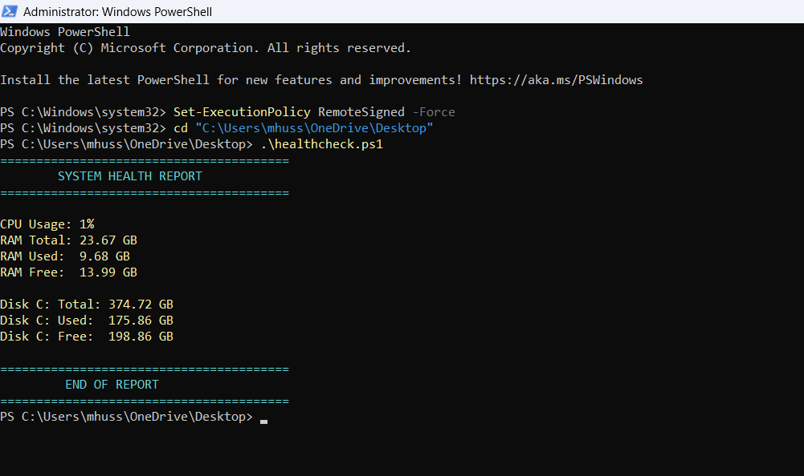
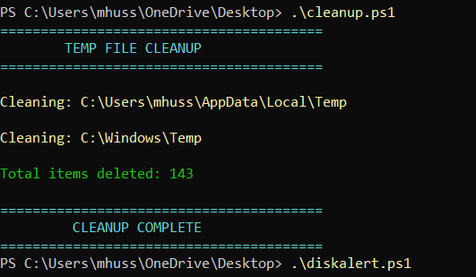
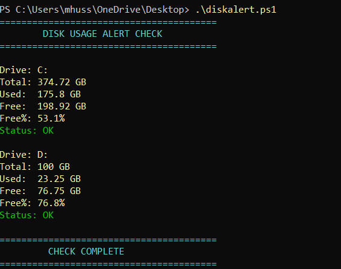
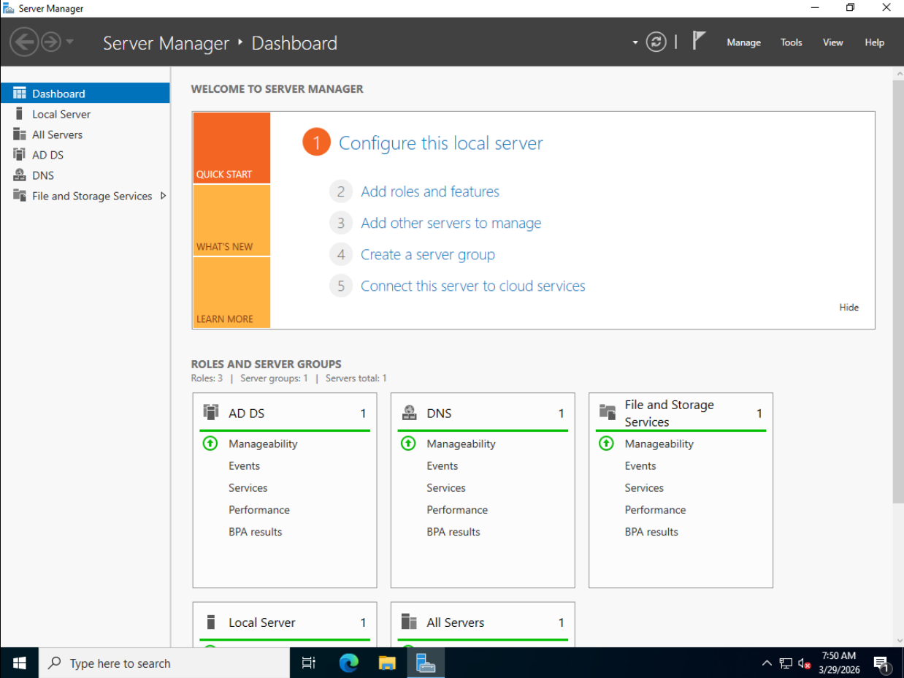
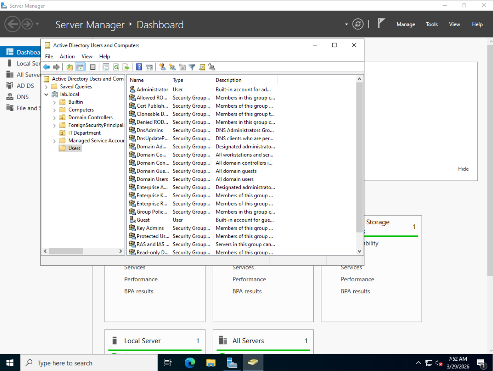
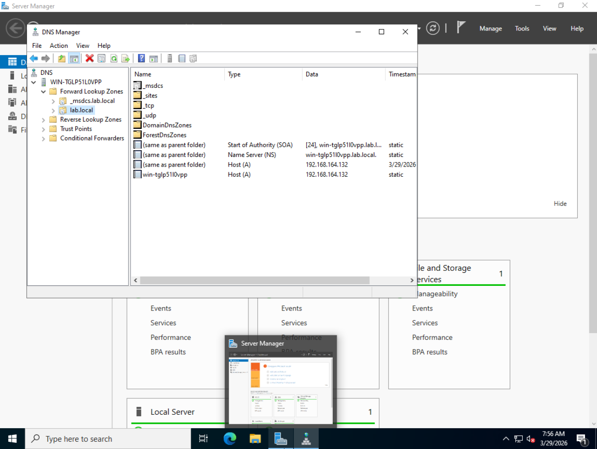
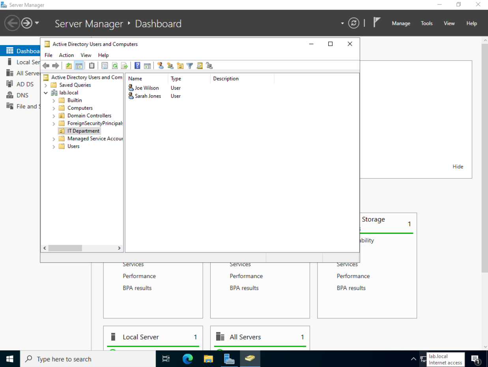
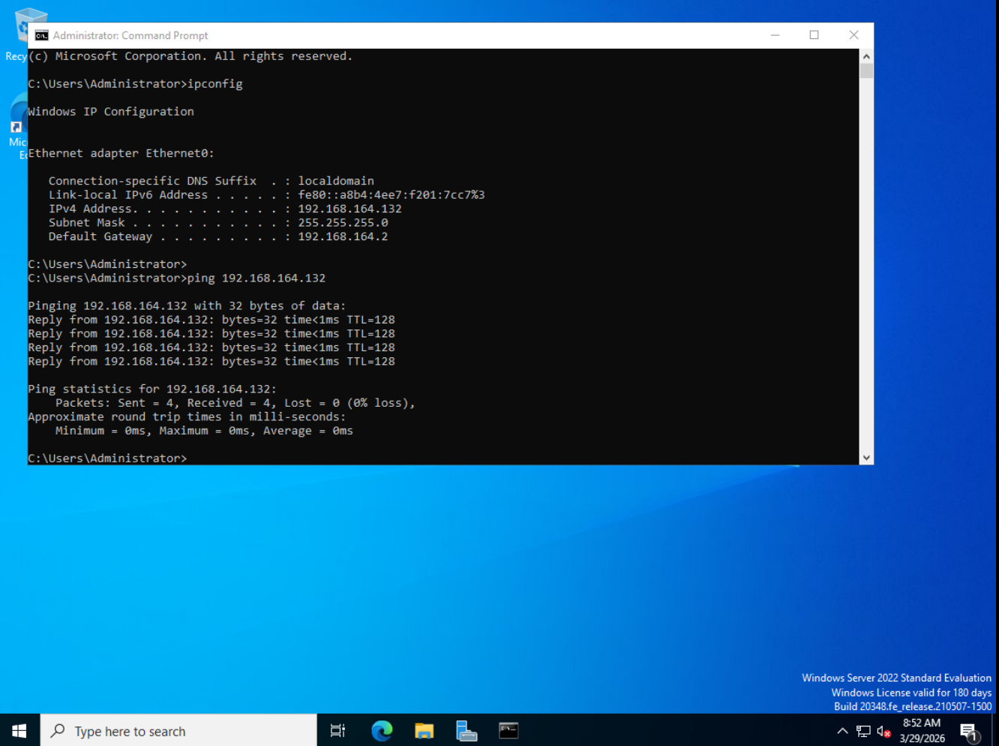
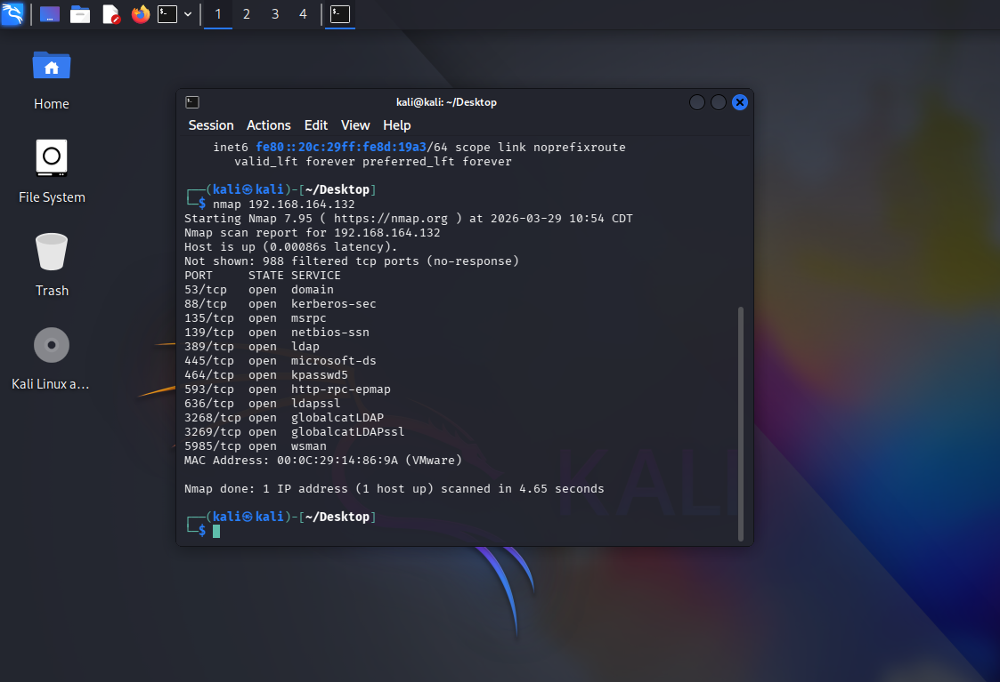
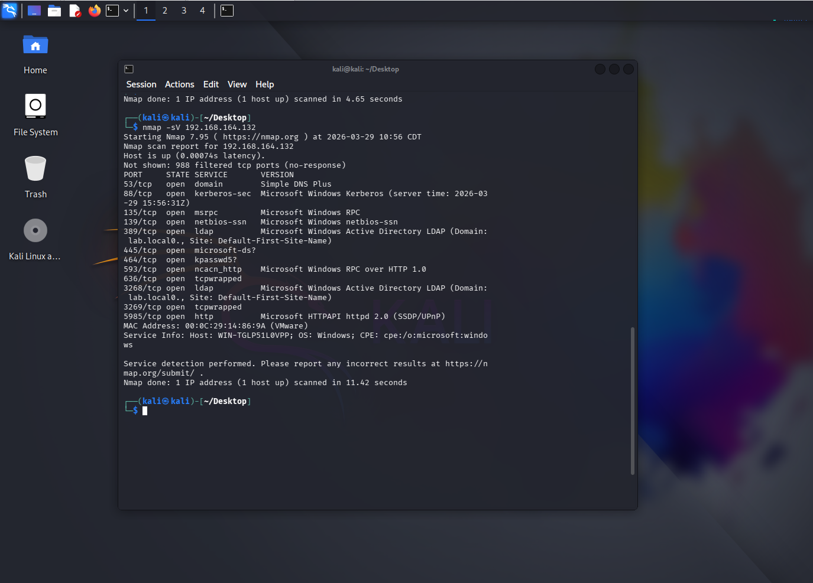

# IT Support Portfolio

A collection of practical IT Support projects demonstrating real-world skills in PowerShell automation, Windows Server administration, Active Directory, and network troubleshooting.

---

## 🖥️ System Health Check
Displays CPU usage, RAM, and Disk space in a clean report.

**Script:** `healthcheck.ps1`

---

## 🧹 Temp File Cleanup
Automatically deletes junk temp files from Windows.

**Script:** `cleanup.ps1`

---

## ⚠️ Disk Usage Alert
Checks all drives and warns if free space is below 20GB.

**Script:** `diskalert.ps1`

---

## 🌐 Network Troubleshooting Runbook
A professional reference guide for diagnosing and resolving common network issues.

**Document:** `network-runbook.md`

---

## 🏠 Windows Server 2022 Home Lab
Built a fully functional Active Directory environment using VMware Workstation.

- Installed Windows Server 2022
- Configured Active Directory Domain Services
- Created domain lab.local
- Set up DNS Server
- Created Organizational Units and user accounts

**Document:** `homelab.md`

---
## 🔒 Security Scan Report
Performed network reconnaissance on Windows Server 2022 Domain Controller 
using Nmap from Kali Linux in an isolated lab environment.

- Identified 9 open ports including DNS, Kerberos, LDAP and SMB
- Confirmed target as Active Directory Domain Controller for lab.local
- Provided security recommendations based on findings

*Document:* security-scan-report.md

---

## 🛠️ Tools Used
- PowerShell
- Windows Server 2022
- VMware Workstation
- Active Directory
- DNS
- GitHub
- Kali Linux

---

## 👤 About
IT Support Specialist | Google IT Support Certificate
