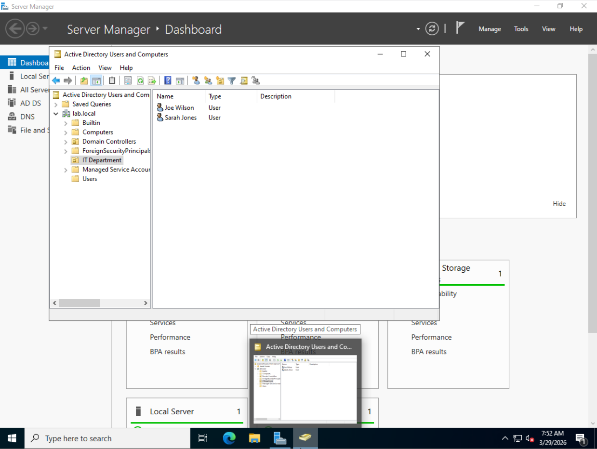

# Home Lab - Windows Server 2022 & Active Directory

## Overview
Built a Windows Server 2022 home lab using VMware Workstation to simulate 
a real enterprise IT environment.

## Environment
- **Hypervisor:** VMware Workstation Pro
- **OS:** Windows Server 2022 Standard Evaluation
- **Domain:** lab.local

## What I Configured
- Installed Windows Server 2022 as a Virtual Machine
- Installed and configured Active Directory Domain Services (AD DS)
- Promoted server to Domain Controller
- Configured DNS Server
- Created Organizational Unit (IT Department)
- Created and managed user accounts (jsmith, sjones)

## Screenshots

## Skills Demonstrated
- Windows Server administration
- Active Directory configuration
- DNS management
- User and OU management
- VMware virtualization